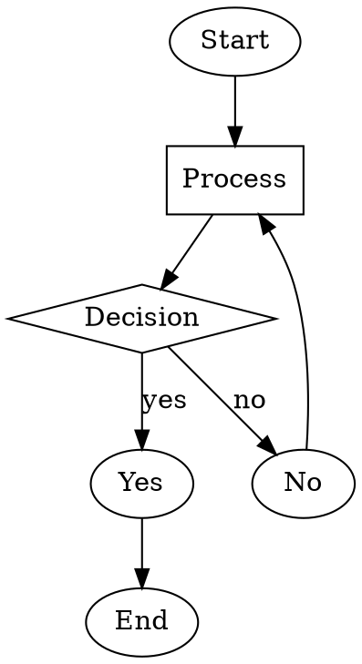
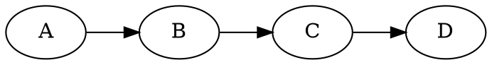

# Canva App Review - Code-to-Diagram

## Reviewer Contact Email

**bhavnani.naveen@gmail.com**

---

## 1. How the App Works

**Code-to-Diagram** is a client-side only app that converts text-based diagram syntax into visual diagrams that can be inserted into Canva designs.

### Supported Diagram Types

| Type | Description | Use Case |
|------|-------------|----------|
| **DOT (Graphviz)** | Graph description language | Flowcharts, process diagrams, DAGs |
| **Nomnoml** | UML notation language | Class diagrams, entity relationships |
| **WaveDrom** | JSON-based timing notation | Digital timing diagrams, signal waveforms |

### User Flow

1. Select diagram syntax type from dropdown
2. Enter/paste diagram code in the editor
3. View live preview of rendered diagram
4. Click "Add to Design" to insert into Canva design

---

## 2. Where to Find Content

All diagram content is **user-generated**. Users write their own diagram syntax code. The app provides placeholder examples for each syntax type when switching between them.

---

## 3. AI Disclosure

**This app does NOT use any AI.**

All diagram rendering is performed 100% client-side using open-source visualization libraries:

- [Viz.js](https://github.com/nicknisi/viz-js) for Graphviz/DOT syntax
- [nomnoml](https://github.com/skanaar/nomnoml) for UML diagrams
- [WaveDrom](https://github.com/wavedrom/wavedrom) for timing diagrams

No external API calls, no AI models, no data sent to external servers.

---

## 4. Reference Websites for Verification

Testers can verify diagram output matches these official implementations:

| Diagram Type | Official Online Editor |
|--------------|----------------------|
| **DOT (Graphviz)** | https://edotor.net/ or https://magjac.com/graphviz-visual-editor/ |
| **Nomnoml** | https://www.nomnoml.com/ |
| **WaveDrom** | https://wavedrom.com/editor.html |

---

## 5. Test Cases

### Test Case 1: DOT/Graphviz - Basic Flowchart

**Input Code:**



**Verify at:** https://edotor.net/

**Expected:** Flowchart with Start → Process → Decision branching to Yes/No, with Yes leading to End and No looping back to Process.

---

### Test Case 2: DOT/Graphviz - Left-to-Right Direction

**Input Code:**



**Verify at:** https://edotor.net/

**Expected:** Four nodes (A, B, C, D) arranged horizontally left-to-right with arrows connecting them.

---

### Test Case 3: Nomnoml - Class Diagram with Methods

**Input Code:**

```
[User|
  +name: string
  +email: string
  |
  +login()
  +logout()
]

[Application|
  -config: Config
  |
  +start()
  +stop()
]

[User] -> [Application]
```

**Verify at:** https://www.nomnoml.com/

**Expected:** Two UML class boxes (User and Application) with fields and methods, connected by an arrow from User to Application.

---

### Test Case 4: Nomnoml - Inheritance Relationship

**Input Code:**

```
[Animal|+name: string|+speak()]
[Dog] -:> [Animal]
[Cat] -:> [Animal]
```

**Verify at:** https://www.nomnoml.com/

**Expected:** Animal class at top with Dog and Cat classes below, connected with inheritance arrows (hollow triangles pointing to Animal).

---

### Test Case 5: WaveDrom - Clock and Data Signals

**Input Code:**

```json
{ "signal": [
  { "name": "clk", "wave": "p......." },
  { "name": "data", "wave": "x.345x..", "data": ["A", "B", "C"] },
  { "name": "req", "wave": "0.1..0.." },
  { "name": "ack", "wave": "1....0.." }
]}
```

**Verify at:** https://wavedrom.com/editor.html

**Expected:** Timing diagram with 4 signals - clock pulse, data bus showing A/B/C values, request signal going high then low, acknowledge signal going low.

---

### Test Case 6: WaveDrom - Simple Two-Signal Diagram

**Input Code:**

```json
{ "signal": [
  { "name": "enable", "wave": "0.1.0.1." },
  { "name": "output", "wave": "x.=.x.=.", "data": ["ON", "ON"] }
]}
```

**Verify at:** https://wavedrom.com/editor.html

**Expected:** Two signals - enable toggling between low and high, output showing "ON" when enable is high.

---

## Summary

This app is a lightweight, client-side only Canva App with:

- No backend services
- No AI integration
- No external API calls
- Pure client-side rendering using open-source libraries

The diagrams generated can be verified against the official online editors listed above to confirm correctness.
